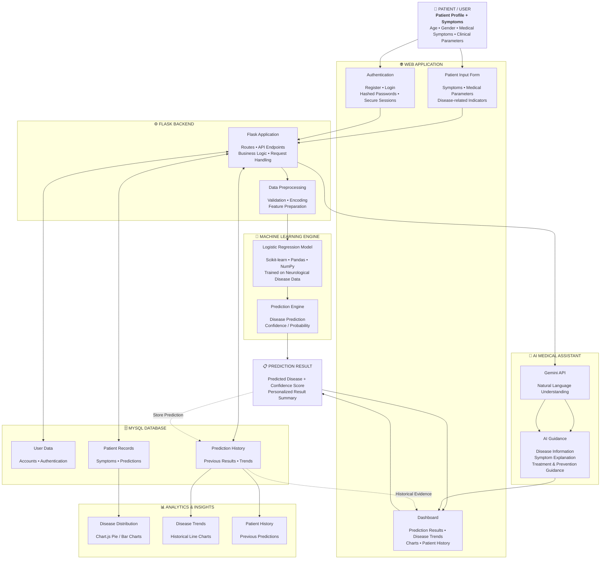

#  NeuroPredict AI – Rare Neurological Disease Predictor

> An AI-powered web application for early detection of rare neurological diseases using Machine Learning, Flask, Chart.js, and the Gemini API.

--- 

## 
Overview

Rare neurological diseases like **Wilson's Disease**, **Niemann–Pick Type C**, **Batten Disease**, and **Creutzfeldt–Jakob Disease (CJD)** are frequently misdiagnosed due to symptom overlap with common disorders. In many regions, patients go undiagnosed for years.

**NeuroPredict AI** bridges this diagnostic gap by providing:
- 🔍 Real-time disease prediction from patient symptoms
- 📊 Interactive dashboards for visualizing disease trends
- 🤖 An AI chatbot (Gemini API) for medical explanations and guidance

---

## 🚀 Features

| Feature | Description |
|---|---|
| 🧬 ML Prediction Engine | Logistic Regression model trained on neurological patient data |
| 📋 Patient Input Form | Collects age, gender, copper levels, tremors, seizures, memory loss, etc. |
| 📊 Interactive Dashboards | Chart.js pie, bar, and line charts for disease distribution and trends |
| 💬 AI Chatbot | Gemini-powered assistant for disease info, symptoms, and remedies |
| 🔐 User Authentication | Secure login/register with hashed passwords |
| 🗄️ Patient History | MySQL database storing prediction records per user |

---

## 🛠️ Tech Stack

- **Backend:** Python, Flask
- **Machine Learning:** Scikit-learn (Logistic Regression), Pandas, NumPy
- **Frontend:** HTML5, CSS3, JavaScript
- **Visualization:** Chart.js
- **AI Chatbot:** Google Gemini API
- **Database:** MySQL
- **Security:** Werkzeug password hashing

---

## 📁 Project Structure

```
NeuroPredict-AI/
├── .vscode/
│   └── settings.json
├── fullstack/
│   ├── static/
│   │   ├── css/
│   │   └── images/
│   ├── templates/
│   │   ├── about.html
│   │   ├── aboutdiseases.html
│   │   ├── batten.html
│   │   ├── batten_prevention.html
│   │   ├── chatbot.html
│   │   ├── cjd.html
│   │   ├── cjd_prevention.html
│   │   ├── contact.html
│   │   ├── dashboard.html
│   │   ├── enter.html
│   │   ├── healthypage.html
│   │   ├── help.html
│   │   ├── home.html
│   │   ├── index.html
│   │   ├── login.html
│   │   ├── logout.html
│   │   ├── npc.html
│   │   ├── npc_prevention.html
│   │   ├── prediction.html
│   │   ├── predictive_form.html
│   │   ├── register.html
│   │   ├── result.html
│   │   ├── wilson.html
│   │   └── wilson_prevention.html
│   ├── .env                        # API keys (not committed)
│   ├── app.py                      # Main Flask application
│   └── rare_neuro_diseases_dataset.csv
└── README.md
```
## 🏗️ Architecture

NeuroPredict AI is a full-stack AI-assisted neurological disease prediction system. It combines patient symptom data, a Machine Learning prediction engine, patient history, interactive analytics, and a Gemini-powered AI assistant into a unified diagnostic-support workflow.



### 🔄 Core Prediction Loop

**Patient Input → Data Preprocessing → ML Prediction → Disease + Confidence → Store History → Dashboard & Analytics**

### 🤖 AI Assistance Loop

**User Question → Flask Backend → Gemini API → Medical Explanation → User**

### 🧠 Complete System Flow

**Patient → Web Interface → Flask Backend → ML Model → Prediction Result → MySQL History → Dashboard → AI Assistance → Continuous Patient Monitoring**

```

### ⭐ One important improvement

Your original README says **“early detection”** and **“medical diagnosis.”** For a student/research prototype, I'd present it as **“AI-assisted prediction”** or **“decision support”** rather than implying it can diagnose patients. That makes the project description more technically and professionally defensible.

For example:

> **NeuroPredict AI is an AI-assisted decision-support prototype that predicts possible rare neurological disease categories from provided patient features and provides educational information through a Gemini-powered assistant.**

This architecture will also look much better in your GitHub README than a simple list of technologies.
```

---

## ⚙️ Setup & Installation

### 1. Clone the repository
```bash
git clone https://github.com/yourusername/NeuroPredict-AI.git
cd NeuroPredict-AI
```

### 2. Create a virtual environment
```bash
python -m venv venv
source venv/bin/activate        # On Windows: venv\Scripts\activate
```

### 3. Install dependencies
```bash
pip install -r requirements.txt
```

### 4. Configure environment variables
Create a `.env` file in the root directory:
```env
GEMINI_API_KEY=your_gemini_api_key_here
MYSQL_HOST=localhost
MYSQL_USER=root
MYSQL_PASSWORD=your_password
MYSQL_DB=neuropredict
```

### 5. Set up the MySQL database
```sql
CREATE DATABASE neuropredict;
```
Then run the app once to auto-create the tables, or import the provided schema.

### 6. Train the model
```bash
python model/train_model.py
```

### 7. Run the application
```bash
python app.py
```

Visit `http://localhost:5000` in your browser.

---

## 🧪 Model Performance

| Metric | Score |
|---|---|
| Accuracy | **90.2%** |
| Precision | High |
| Recall | High |
| F1-Score | High |
| Validation | 5-Fold Cross-Validation |

The model was trained on a curated dataset with SMOTE applied to handle class imbalance across rare disease categories.

---

## 🦠 Diseases Covered

- Wilson's Disease
- Creutzfeldt–Jakob Disease (CJD)
- Niemann–Pick Disease Type C (NPC)
- Batten Disease
- Huntington's Disease
- Amyotrophic Lateral Sclerosis (ALS)
- Multiple System Atrophy (MSA)
- Friedreich's Ataxia
- Spinocerebellar Ataxia (SCA)
- Leigh's Syndrome


---

## ⚠️ Disclaimer

> This application is a **research prototype** and is intended for educational and informational purposes only. It is **not a substitute for professional medical diagnosis**. Always consult a qualified healthcare professional for medical advice.

---

## 🔮 Future Improvements

- [ ] Expand dataset with real clinical records
- [ ] Add Random Forest / Neural Network models
- [ ] Mobile app support
- [ ] Cloud deployment (AWS / GCP)
- [ ] Federated Learning for privacy-preserving training
- [ ] HIPAA / GDPR compliance for clinical use

---

## 📄 License

This project is licensed under the MIT License. See [LICENSE](LICENSE) for details.

---

